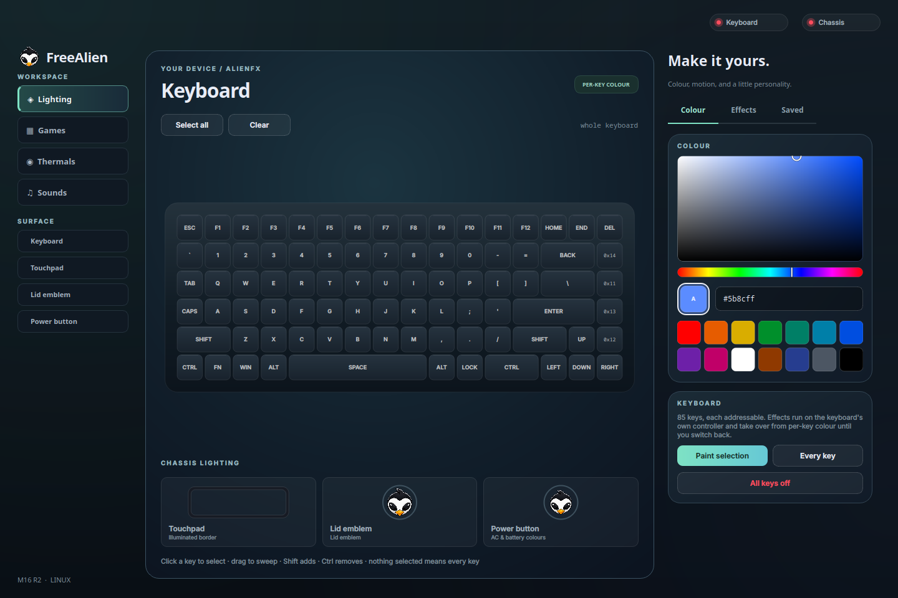
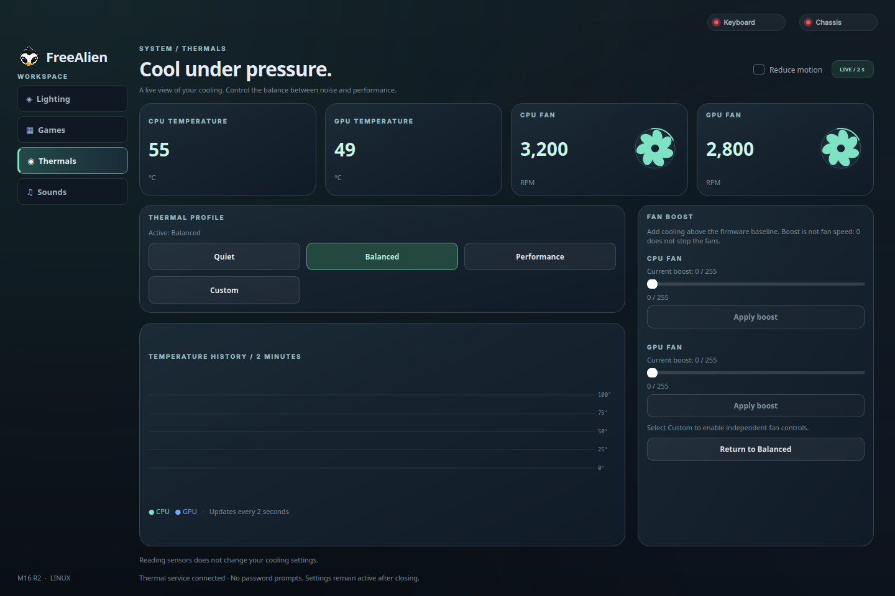

# FreeAlien usage guide

[Back to the project overview](../README.md)

Run checkout commands from the repository root. For installation, updates and
removal, see [the installer guide](../packaging/README.md).

## Using it

```bash
./freealien static red                  # every key
./freealien key blue F1 F2 ESC          # named keys (or 0x15 for a raw id)
./freealien effect breathing purple     # MCU-side, zero host CPU
./freealien effect off                  # back to per-key control

./freealien touchpad green
./freealien logo white --persist        # --persist survives a reboot
./freealien spectrum touchpad
./freealien morph logo red blue
./freealien brightness 128

./freealien power white purple          # AC states white, battery states purple
./freealien off
```

For lighting commands, put the global `--dry-run` option before the subcommand
to print packets instead of sending them, for example `./freealien --dry-run static red`.
Packet output is compared against the captures in `tests/fixtures/v3/`.

Diagnostics:

```bash
./freealien keys            # the 92 LEDs and their positions
./freealien grid            # the canvas grid, and which cells are ambiguous
./freealien probe           # raw controller replies, undecoded
./freealien probe-zones     # walk chassis zone ids to see what each one drives
./freealien identify        # light LEDs one at a time to place them
./freealien demo            # scrolling bar; reports the frame rate reached
```

## The control panel

```bash
./freealien gui
```



PyQt6 — Qt because Plasma is Qt, and a hardware panel should look like it belongs
on the desktop it runs on. Every surface is custom-painted rather than themed, so
the window looks the same whatever widget style happens to be installed.

The studio uses one left sidebar for Lighting, Games, Thermals, and Sounds. Lighting
surfaces live beneath it; the device canvas sits beside focused **Colour**,
**Effects**, and **Saved** controls. The badge above the canvas shows the current
lighting mode.

Keyboard **Pulse** and **Laser** are not offered: Pulse was unreliable on the
m16 R2, and Laser was reported to freeze the previous pattern. Both are also
rejected by the CLI and library.

### Thermals

Use the **Thermals** item in the left sidebar. Thermals shows
live CPU/GPU temperatures and RPM, a two-minute temperature history, and the
profiles actually advertised by your kernel. Monitoring is read-only and updates
on a background thread every two seconds.

The installer selects the thermal service by default. If it was skipped,
click a thermal profile or **Enable thermal controls** to install the small
privileged writer with one-time administrator authentication. The selected profile
is applied after setup succeeds; cancellation leaves settings unchanged. This
requires polkit (`pkexec`). Alternatively, install it from the terminal:

```bash
sudo sh packaging/install-thermals.sh
```

The GUI stays unprivileged. A root-owned socket-activated service handles changes
without per-change password prompts. Its socket is restricted to the installation
user; requests validate profile names, fan IDs and boost values. The service is
sandboxed and can write only to discovered Alienware device trees. Re-run setup
after updating the helper or changing the machine's thermal driver topology.

Fan graphics rotate in proportion to reported RPM at a deliberately slowed visual
speed. Missing readings and stopped fans stay still; hidden pages pause animation.
Use **Reduce motion** in Thermals, or set the startup preference in the installer.

Select **Custom** before applying individual fan boosts. The range is the driver's
raw **0–255 boost**, not an RPM or duty-cycle percentage. Zero removes added boost;
it does not stop a fan. Firmware retains control of its baseline. **Return to
Balanced** selects the automatic Balanced profile; closing the GUI does not undo
settings. Readback errors and authentication cancellation are shown explicitly.
The kernel remains responsible for thermal protection; there is no host fan-curve
loop in this release.

Driver reference: [Linux Alienware WMI documentation](https://www.kernel.org/doc/html/latest/admin-guide/laptops/alienware-wmi.html).

To inspect thermal support without changing anything:

```bash
python3 -m awcfree_lib.thermals status
```



Illustrative thermal readings shown; the app uses live sensor data.

### One part at a time

The machine has four lit parts and they are not variations on each other: the
keyboard is 85 individually addressable LEDs on one controller, the touchpad and
lid emblem are single zones on another, and the power button has no colour of its own
at all. So the panel asks which part you are working on first, and then offers only
what that part can do.

| Part | What you get |
| --- | --- |
| **Keyboard** | click/drag key selection, per-key colour, the six controller-side effects, tempo |
| **Touchpad** | one colour, chassis effects, brightness, keep-after-reboot |
| **Lid emblem** | the same as the touchpad — they are the same kind of zone |
| **Power button** | an AC colour and a battery colour, and nothing else |

Choosing a part dims the keyboard picture and stops it taking clicks, so selecting
the lid never leaves the keyboard's own controls sitting there competing for the
colour picker. The cards under the keyboard select a part too.

The second colour slot, **B**, only appears when it would do something: on the two
keyboard effects that read a pair (dual wave and mixed pulse), on the chassis morph,
and on the power button, where A is the AC colour and B the battery one. Which
effects those are is not a guess — it is `protocol.v5.EFFECT_COLOURS`, from
alienfx-tools naming type 4 "dual color wave" and type 9 "mix pulse (2 colors)".

Capabilities live in `gui/parts.py`, one entry per part, so adding a surface later
is a new entry rather than a hunt through the UI.

- **The keyboard is the real one.** Key positions come from `layout.CELLS`, which
  was measured with a camera, so the picture on screen is this machine's actual key
  arrangement rather than a stock illustration.
- **Lit keys glow.** Two overlapping halos per key, strength following brightness,
  drawn underneath the key faces so a bright neighbour spills light onto the deck
  the way it does in front of you.
- **Chassis surfaces are drawn as what they are** — a ring for the touchpad, since
  only its border lights; the project mascot for the lid and power controls, with rings showing their lighting colour.
- Presets save keys and zones together to `~/.config/awcfree/presets.json`.

PyQt6 is the project's only Python dependency and only the GUI needs it — the library, the
CLI and the games run on the standard library alone. Install it with
`sudo apt install python3-pyqt6`.

USB writes take a few milliseconds each and dragging the colour picker fires them
continuously, so the hardware runs on a worker thread and requests are *coalesced*
rather than queued: a newer request for the same target replaces the pending one,
which is what stops the lighting lagging seconds behind the cursor.

## Keyboard sounds

Open **Sounds** in the left sidebar. Choose **Fart Lab**, **Gaming Keyboard**, or
**Freedom mode** and audition the pack by typing in the preview pad. The bundled libraries contain 13 recorded fart-foley performances, 32
Cherry keyboard strikes, and 17 firearm clips from the Free Firearm Sound Library.
Freedom mode includes recorded 1911, AR-15, AK-47, Mossberg, and Walther PPQ sounds;
Enter uses a recorded automatic burst, Space a shotgun, and Backspace a pistol.
Each sound family
shuffles its recordings before reuse, with no immediate repeats. Enter plays a
longer, stronger recording (a double recorded clack for the keyboard pack), and
modifiers use shorter clips. The **Special Enter
sounds** switch makes Enter use an ordinary sound instead. Use **Volume** and
**Enable / Mute key sounds** to control playback.

**Inside FreeAlien** is the default and plays while this app has focus, including other workspaces.
Choose **Everywhere**, then **Enable key sounds**, to play across applications, including when
FreeAlien is in the background or minimized. On X11 it uses `xinput test-xi2`;
on Wayland, **Automatic · all connected typing keyboards** is the default. It
listens to both the laptop and external keyboards and detects reconnections.
You can select one specific keyboard instead. The capture status lists the
keyboards actually being read and identifies any that still need permission.
Input is
read-only: it does not grab keys, change typing, record text, or send keystrokes
over the network. Global mode does not also play the same event through the GUI.
Holding a key produces one sound rather than a stream of auto-repeat sounds.
Closing FreeAlien stops listening and audio playback.

All three packs use bundled recordings, not procedurally generated waveforms.
No download is needed during playback. See [CREDITS.md](../CREDITS.md#keyboard-sounds)
and `awcfree_lib/sounds/assets/manifest.json` for authors, licenses and source
recordings. Fart Lab uses LFA's mouth/hand-recorded fart foley.
Audio mixes overlapping sounds through one persistent `libpulse-simple` stream;
it works with PulseAudio or PipeWire-Pulse without launching a player per key.
On Debian/Ubuntu, the runtime audio library is supplied by `libpulse0`; X11 global
input additionally needs `xinput`. Neither is needed just to open the rest of the GUI.

The **Enable key sounds** button also handles setup. If your selected keyboard
needs native input permission, it requests administrator authentication once,
then starts playback automatically. Cancelling leaves sounds off. X11 generally
needs no permission setup. Native setup requires `pkexec` (polkit) and `udevadm`.
There is no separate sound service to manage: muting stops the listener, and
closing FreeAlien stops both listening and playback.

Background input produces only sound categories (ordinary press, Enter, Space,
Backspace/Delete, modifiers) for playback; letter names are not passed to audio
or shown in the preview. Native input still needs keyboard-event access to detect
presses across applications. It cannot distinguish a password field from other
input. The audition pad plays sounds without displaying keys or sample counters.

Reconnect the keyboard or log out and back in if its permissions do not update.
The rule uses `uaccess` for the active local session and matches the chosen keyboard
by name; standard `uaccess` ACLs grant read/write device access, while FreeAlien opens
the device read-only. This access
also lets other programs in your session read that keyboard. No input-group
membership, world-readable devices, or privileged sound service is needed. Remove
the rule, reload udev rules and trigger the input devices, then log out or reboot to fully
revoke existing access. The TUI uninstaller handles rule removal as an option.

## Games

The GUI's **Games** workspace runs Snake, Minesweeper, and Zombie Defense on the
keyboard. Snake and Minesweeper use a contiguous 10×4 area backed by measured LEDs;
the function-key row stays outside the board and lights as a Minesweeper legend
(F1 red for one nearby mine,
then orange, yellow, green, blue, and violet through F6). In Minesweeper, click to
reveal and right-click to flag, or use the keyboard: pressing a board key reveals
that matching square; Ctrl plus that key flags it. Arrow keys move the cursor,
Enter/Space reveals the cursor, and Esc ends the round. Re-press a revealed number
to open its covered neighbours after flagging the matching count. Ctrl+Shift+M opens
Minesweeper from anywhere in the app. The first key starts the round, with a short
start animation; win, loss, and manual end each have their own end animation. The
opening reveal is always safe, and the mine count can be adjusted. Leaving Games
restores the previous keyboard colours.

Zombie Defense uses three full-width keyboard lanes. Press **Start**, then hold and
release **Tab**, **Caps Lock**, or **Left Shift** to fire down that lane. Holding
charges the shot; charged shots hit harder and splash zombies in lower lanes.
Zombies approach from the right, their red LED brightness shows remaining health,
and the GUI and keyboard both animate bullets and impacts. Shot, hit, and kill
sounds are synthesized locally and played through `paplay`, `pw-play`, or `aplay`
when one is installed. Leaving Games restores the previous keyboard colours.

### T-Rex runner (GUI)

Open **Games → T-Rex** in `./freealien gui`. The runner works entirely offline,
with an animated desert on screen and a matching 10 × 4 keyboard LED field:
green is the dinosaur, red is a cactus, and amber is a flying obstacle.
The dinosaur turns **white when it is time to jump**, about 0.4 seconds before
an approaching ground obstacle. Tap Space at that cue; hold for a higher jump.
The keyboard-friendly pace starts at 240 pixels/second and caps at 360.

- **Space / Up / W** starts and jumps; hold for a higher jump, release for a short hop.
- **Down / S** ducks while held and drops faster in the air.
- **P** pauses or resumes; **Esc** pauses; **R** starts a fresh run.
- Space starts again after a collision. Losing window focus automatically pauses.

Cactus sizes and groups vary, birds appear after 100 points, and running speed
increases to a capped maximum. Every 100 points plays a milestone tone; day and
night alternate every 700 points. The best score survives restarts in
`$XDG_CONFIG_HOME/awcfree/trex-score` (normally `~/.config/awcfree/trex-score`).
Jump and collision sounds use the existing optional system audio player. Leaving
the game restores your keyboard lighting. No downloads or network access are needed.

### Snake (CLI)

```bash
./freealien snake                     # arrows or WASD, p pause, r restart, q quit
./freealien snake --walls             # make the edges lethal again
./freealien snake --field wide        # bigger board, see the caveat below
./freealien snake --speed 7 --max-speed 18
```

**All four edges wrap.** Run off the right and you come back on the left, off the
top and you come back on the bottom, so the only way to lose is to run into
yourself. On a 10x5 board that matters: with lethal edges the dangerous moment is
the first few seconds of a round rather than the end of a long one. `--walls`
restores lethal edges.

The board is 16x6 but eleven of those cells have no LED behind them, and a cell with
no LED cannot be drawn — a wall there is invisible, and a snake crossing it
disappears. So the default field is the largest solid rectangle, 10x5 (columns 2-11
of rows 0-4), where every cell lights and there is nothing to collide with but
yourself. `--field wide` and `--field full` trade that for space and turn the holes
into walls you cannot see; wrapping does not save you from those, since it only
applies at the edges.

Speed climbs with the score, from 5 moves a second to 14. Turns are queued rather
than overwritten, so pressing up then left inside a single tick gives you both on
consecutive ticks instead of folding the snake back on itself.

### Writing another one

`SnakeGame` does no I/O at all: it moves cells around a grid and knows nothing about
keyboards or terminals, which is why `tests/test_snake.py` can play hundreds of
games with no hardware attached. `games/runner.py` owns the loop and takes anything
with `step`, `render` and `alive`, so a second game needs no changes to it.

## As a library

```python
from awcfree_lib import Canvas, Keyboard, Chassis, layout

with Keyboard() as kb:
    kb.fill((0, 0, 0))
    kb.set(layout.by_name("F1"), (255, 0, 0))
    kb.flush()                      # only what changed goes on the wire

with Chassis() as ch:
    ch.set_logo((255, 255, 255))
    ch.spectrum(0x00)

# the games foundation: a grid, not a list of ids
canvas = Canvas()
with Keyboard() as kb:
    for col in range(canvas.cols):
        canvas.clear()
        canvas.vline(col, (0, 120, 255))
        canvas.present(kb)          # diffed; a one-cell change is one report
```

`Canvas.rows_as_text()` renders to the terminal, so game logic can be developed and
tested with no keyboard attached.

## Why it is fast

A full 92-LED refresh is 10 reports. The `Keyboard` object remembers what the
hardware last received and sends only the difference, so:

| change | reports | measured on hardware |
| --- | --- | --- |
| full refresh | 10 | — |
| full board recolour | 8 | 12.6 ms → 80 fps |
| one cell | 3 | 4.0 ms → 248 fps |
| nothing | 0 | no USB traffic at all |

Three is the floor — one colour frame plus `LOOP` and `UPDATE`. A typical game frame
moves a few cells and so costs the floor, which leaves snake at 30 fps with about
eight times the headroom it needs. Encoding a full frame costs 0.09 ms of CPU, so
the report count sets the ceiling, and there are no fixed sleeps to pay on top.

## The key map is measured, not guessed

`layout.py` was produced by lighting each LED on its own and locating it with a
webcam, rather than by reading positions off a photograph. The detector diffs each
frame against a dark reference, masks to the keyboard, and takes the topmost strong
band of the blob -- the deck below the keyboard is glossy enough that a bottom-row
key's reflection outshines the key itself, so anchoring anywhere but the top edge
puts those keys a whole row low.

Rows come from gap-clustering the tilt-corrected y; columns from a global origin and
pitch, assigned per row by a least-squares strictly-increasing fit, because the
board is staggered and a greedy tie-break cascades a whole row sideways.

### What is and is not verified

A camera cannot confirm the column assignment by lighting a column and checking
those LEDs lit: that lights LED X from `CELLS[X]` and then looks at `PIXELS[X]`, X's
own measured spot, which is bright whatever column the fit chose. A deliberately
shuffled layout passes that test, which is how the flaw was found. `PIXELS` is the
ground truth and `CELLS` is a pure function of it, so the two have to be checked
separately:

- **`PIXELS` is unambiguous.** The two closest measured LEDs are 0.57 of a key pitch
  apart, so no detection landed on a neighbour.
- **The fit is well behaved.** Columns increase strictly with x in every row, and
  residuals average 0.23 key widths (worst 0.58, in the staggered home row).
  `dev/tools/verify_grid.py --numeric` re-checks both with no hardware.
- **By eye, end to end.** `--pattern cols` lights alternating columns: any
  misassignment breaks the alternation or the vertical line, and in the photograph
  neither happens in any of the six rows. `--pattern rows` does the same per row,
  and each physical row comes out uniform. Key labels were read off those photos;
  naming 13 keys and lighting them puts the light on exactly those keys.

Two results worth knowing:

- The ids run in physical order, left to right within each row. Nothing in the
  protocol promises that, and it came out of the raw measurement, so it is
  independent evidence the fit is right.
- Only **85 of the 92** addressable ids drive a physical LED here. Driven together
  at full white the other seven raise the peak frame difference to 9.8 against 136
  for seven ordinary keys, with zero pixels over threshold -- they light nothing.
  They are very likely keys present on the ISO and ABNT2 builds of this chassis.
  `ALL_LEDS` still carries all 92 so our packets match the stock software's.

## Known gaps

- Four keys in the right-hand media column (`0x11`-`0x14`) are placed but unnamed;
  their icons were not legible in the photographs. `freealien identify` names them.
- Power-state names within each trio (`ac_sleep` / `ac_on` / `ac_charging`) are
  inferred from the action kind AWCC uses, not confirmed against the hardware.
- Chassis zones `0x01`, `0x03` and above were never seen in a capture on this
  machine. `freealien probe-zones` finds out whether they drive anything.
- The two RGB triples in the v5 global block were zero in every capture, so their
  effect is structural inference.

See [credits](../CREDITS.md) for protocol sources and asset attribution.
